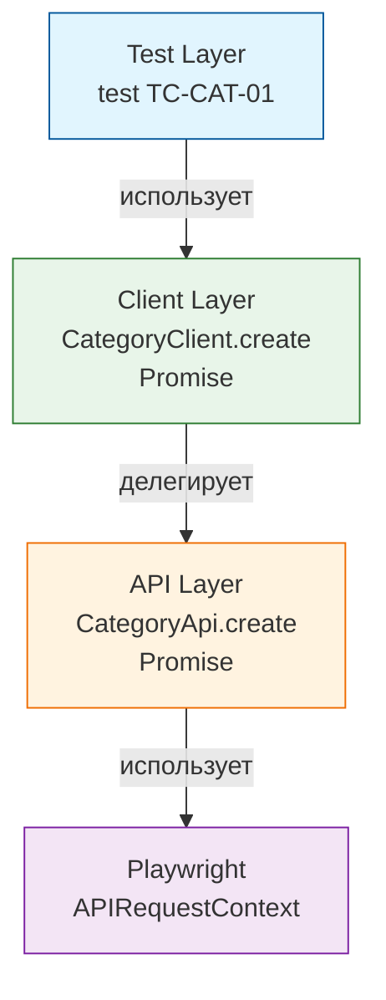

# sideglance-qa
> E2E и API-тесты для галереи [sideglance.ru](https://sideglance.ru)  
> TypeScript/Playwright + Python/Selenium/Pythest | CI/CD в GitHub Actions | Allure отчёты

[](https://github.com/lmveilfire/sideglance-qa/actions)
[](https://playwright.dev)
[](https://opensource.org/licenses/MIT)

### 1. Архитектура

## Typescript-playwright
```
typescript-playwright/           
├── src
│   ├── api                     # Слой транспорта: чистые HTTP-обёртки
│   ├── clients                 # Слой клиентов: бизнес-методы поверх Api
│   ├── fixtures                # Изолированные фикстуры: auth, cleanup
│   ├── helpers                 # Хелперы: генераторы данных, декораторы @step, statusIn
│   ├── pages                   # Page Objects для UI-тестов
│   └── utils                   # Утилиты
├── tests                       # Тесты
│   ├── api                     # API-тесты: контракты, негативные сценарии, rate-limit
│   └── ui                      # UI-тесты
├── package.json                # Скрипты, зависимости, typescript
├── playwright.config.ts        # Конфиг: окружения, ретраи, отчёты
└── tsconfig.json
 
```

### Ключевые принципы

## Typescript/Playwright



### CI/CD

## Playwright.yml
1. Чекаутит приватный репо с кодом приложения
2. Создаёт .env из GitHub Secrets
3. Восстанавливает кэш node_modules из предыдущих запусков (по хэшу package-lock.json)
4. Устанавливает Node.js 24 и зависимости через npm ci
5. Устанавливает браузер Chromium и системные зависимости
6. Собирает фронтенд (React) с увеличенным лимитом памяти
7. Собирает бэкенд (Spring) и фронтенд в Docker
8. Поднимает окружение (PostgreSQL, backend, frontend) с healthcheck-ами
9. Ожидает готовности backend и frontend через curl в цикле
10. Запускает Playwright-тесты с изоляцией
11. Архивирует Playwright и Allure отчёты как артефакты
12. Очищает окружение: останавливает контейнеры и удаляет volumes

### Безопасность
* Все секреты — в GitHub Secrets
* Токены не коммитятся, не логируются
* Тестовые данные изолированы от продакшена

### Результаты прогона
1. Перейти по вкладке Actions
2. Кликнуть на workflow CI Tests Typescript Playwright или CI Tests Python
3. Открыть результаты тестов