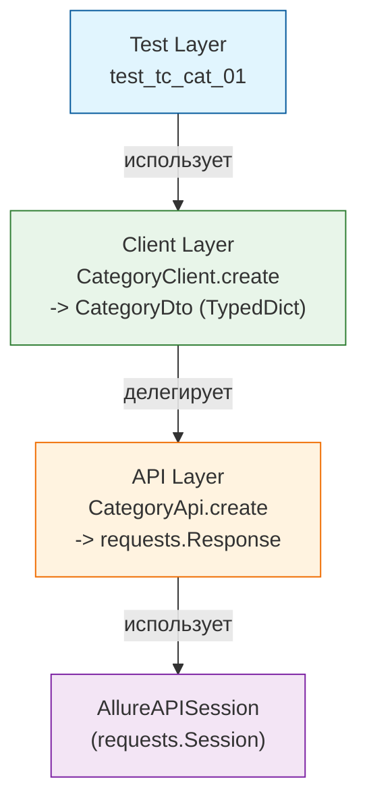

> API-тесты для галереи [sideglance.ru](https://sideglance.ru)

[](https://github.com/lmveilfire/sideglance-qa/actions/workflows/python-pytest.yml)
[](https://www.python.org)
[](https://docs.pytest.org/)
[](https://mypy-lang.org)

### Стек технологий:

**Язык**: Python 3.10


**Тестовый движок**: pytest


**Типизация**: mypy в режиме --strict


**Качество кода**: ruff (линт + форматирование одним инструментом, замена flake8 + isort + black)


**HTTP-клиент**: requests


**Тестовые данные**: Faker


**Частичное сравнение объектов**: dirty-equals


**Управление окружением**: python-dotenv (конфигурация через .env)


**Отчётность**: Allure Report (allure-pytest) + pytest-html


### Архитектура
```
python-pytest/
├── src
│   ├── api                     # Слой транспорта: чистые HTTP-обёртки поверх requests, без единой проверки статуса внутри
│   ├── clients                 # Слой клиентов
│   ├── helpers                 # `AuthHelper`, `CaptchaHelper` — сквозные сценарии поверх api
│   └── utils
│       ├── constants.py        # HTTP-коды, адреса, лимиты
│       ├── decorators.py       # `@step()` — читаемые шаги в Allure-отчёте
│       ├── generators.py       # Faker-генераторы тестовых данных
│       ├── headers.py          # Утилита `mergeHeaders` для кастомного хелпера авторизации
│       ├── matchers.py         # Именованные шаблоны для валидации ответов на базе dirty-equals
│       └── types.py            # Слой DTO: структуры TypedDict для строгого контроля типов
├── tests
│   └── api                     # API-тесты: контракты, негативные сценарии, rate-limit
├── conftest.py                 # Граф фикстур pytest + AllureAPISession
├── pytest.ini                  # Маркеры, `--strict-markers`, опции запуска
├── pyproject.toml              # Конфигурация mypy (`strict`) и ruff в одном месте
└── requirements.txt / requirements-test.txt / requirements-dev.txt
    # Зависимости разделены по назначению: рантайм / прогон+отчётность / только разработка
```

### Ключевые принципы


**Гибкая валидация контрактов:**


 Использование декларативных шаблонов `PhotoMatcher`, `CategoryMatcher` и др. на базе `dirty-equals`. Проверка валидирует только структуру и типы полей (`IsPartialDict`, `IsInt`, `IsStr`), что защищает тесты от каскадных падений при изменении динамических данных вроде счетчиков лайков или ID.

**Изоляция транспортного уровня:**


Слой `api` отвечает только за транспорт и возвращает `requests.Response` как есть, не анализируя статус-коды. Такое разделение осознанно: негативные тесты (без токена, с невалидными телами) обращаются к слою `api` напрямую, чтобы проверять ошибки. Для позитивных сценариев реализован слой `clients`, провалидированная обертка над `api`.

### Типизация
Во фреймворке используется строгая типизация. Поскольку в Python это не встроенная фича, здесь настроен `mypy` в режиме `--strict` (с запретом Any-генериков, функций без аннотаций и т. д.). Ответы бэкенда описываются через структуры `TypedDict`. В местах, где метод `requests.Response.json()` возвращает динамический `Any`, вместо подавления проверок комментариями используется явное приведение к конкретному DTO через `cast()`.

### CI/CD
1. Чекаутит репозиторий с тестами
2. Чекаутит приватный репозиторий с исходным кодом приложения по токену.
3. Устанавливает Python 3.10 с кэшированием pip
4. Из файлов requirements.txt устанавливаются все основные, тестовые и dev-пакеты фреймворка
5. Утилита ruff проверяет соответствие кода тестов принятым стандартам оформления
6. Выполняется быстрый статический анализ кода на наличие потенциальных ошибок и багов
7. Линтер mypy проверяет корректность аннотаций типов в исходном коде тестового фреймворка, тестах и конфигурационных файлах.
8. Создаёт .env на основе GitHub Secrets
9. Собирает фронтенд (React) с увеличенным лимитом памяти, чтобы избежать падения раннера
10. Запускается сборка образов бэкенда (Spring Boot) и фронтенда внутри Docker context
11. Поднимает окружение (PostgreSQL, backend, frontend) с healthcheck-ами
12. Контролирует готовность сервисов. Скрипт в цикле опрашивает эндпоинты /health бэкенда и фронтенда через curl, ожидая их полной готовности к тестам
13. Запускаются api-тесты Pytest прямо на хосте раннера
14. Архивирует HTML- и Allure-отчёты как артефакты GitHub Actions
15. Очищает окружение: останавливает контейнеры и удаляет volumes


### Осознанные ограничения:
**Тест на рейт-лимит логина изолирован от общего прогона** 


Обнаружено реальным прогоном в CI: бэкенд после серии неудачных попыток логина блокирует IP на срок, превышающий длительность всего остального тестового набора. Тест исключен из общего прогона в CI с помощью маркера `@pytest.mark.skip`.

**Параллельный запуск (pytest-xdist) в CI пока не используется**


При текущем размере набора тестов последовательный прогон не создаёт заметных издержек по времени.