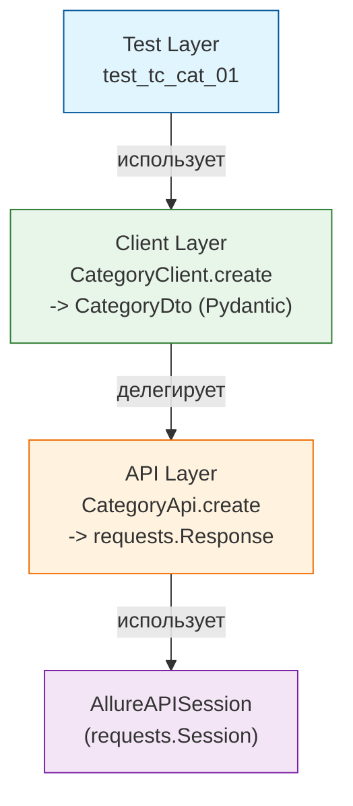

> API-тесты для галереи [sideglance.ru](https://sideglance.ru)

[](https://github.com/lmveilfire/sideglance-qa/actions/workflows/python-api-tests.yml)
[](https://github.com/lmveilfire/sideglance-qa/actions/workflows/python-ui-tests.yml)
[](https://www.python.org)
[](https://docs.pytest.org/)
[](https://playwright.dev)
[](https://pydantic.dev)
[](https://mypy-lang.org)

### Стек технологий:

*   **Язык**: Python 3.10
*   **Тестовый движок**: pytest 9.1+
*   **Валидация и DTO**: Pydantic v2 (строгий рантайм-контроль контрактов API)
*   **Статический анализ**: mypy 2.3+ (в режиме `--strict`)
*   **Качество кода**: ruff (линтинг + форматирование в едином быстром тулчейне)
*   **HTTP-клиент**: requests
*   **Тестовые данные**: Faker (динамическая генерация)
*   **Управление конфигурацией**: python-dotenv (многоуровневая среда через `.env`)
*   **Отчётность**: Allure Report (`allure-pytest`) + `pytest-html`


### Архитектура
```
python-pytest/
├── src
│   ├── api                     # Слой транспорта: чистые HTTP-обёртки поверх requests, без единой проверки статуса внутри
│   ├── clients                 # Слой клиентов
│   ├── helpers                 # `AuthHelper`, `CaptchaHelper` — сквозные сценарии поверх api
│   ├── pages                   # UI Слой: Page Object классы для Playwright (локаторы)
│   └── utils
│       ├── constants.py        # HTTP-коды, лимиты
│       ├── generators.py       # Faker-генераторы тестовых данных
│       ├── headers.py          # Утилита `mergeHeaders` для кастомного хелпера авторизации
│       └── models.py           # Pydantic-модели
├── tests
│   ├── api                     # API-тесты: контракты, негативные сценарии, rate-limit
│   │   ├── auth                # Авторизация: сессии, JWT-токены, валидация payload и блокировки
│   │   ├── categories          # Категории: создание, удаление и контроль структуры контрактов
│   │   ├── comments            # Комментарии: модерация, защита от спама (honeypot, слишком быстрые ответы) и rate-limit
│   │   ├── photos              # Фотографии: загрузка медиафайлов, инкремент лайков
|   │   └── subcategories       # Подкатегории: полный жизненный цикл и контрактные связи с родительскими категориями 
│   └── ui                      # UI/E2E-тесты: сквозные сценарии на Playwright
│        ├── admin              # Панель управления: закрытая часть для администратора
│        │   ├── auth          # Авторизация админа: успешный логин, редиректы, невалидные пароли
│        │   ├── moderate      # Модерация: одобрение, отклонение и фильтрация комментариев
│        │   └── upload        # Загрузка контента: добавление фото, валидация полей ввода
│        ├── users              # Публичная часть: действия обычных пользователей (просмотр, карусель, лайки)
│        └── conftest.py        # Фикстуры для UI: запуск браузера, контексты Playwright, сессии страниц   
├── conftest.py                 # Граф фикстур pytest + AllureAPISession
├── pytest.ini                  # Маркеры, `--strict-markers`, опции запуска
├── pyproject.toml              # Конфигурация mypy (`strict`) и ruff в одном месте
└── requirements.txt / requirements-test.txt / requirements-dev.txt
    # Зависимости разделены по назначению: рантайм / прогон+отчётность / только разработка
```

### Ключевые принципы


### Type-Driven Валидация контрактов (Pydantic v2)

Высокоуровневые клиенты автоматически валидируют входящие JSON-структуры и массивы (`TypeAdapter`) в момент их получения. Работа с ответами API в тесах происходит через свойства объектов (`photo.id`, `page.totalCount`), а не через строковые ключи словарей.

### Изоляция транспортного уровня:

Слой `api` отвечает исключительно за отправку HTTP-запросов и возвращает «сырой» `requests.Response`. Используется напрямую в негативных тест-кейсах, где необходимо умышленно ломать заголовки/капчи и проверять коды ошибок. Слой `сlient` инкапсулирует позитивную логику. Он доверяет контракту бэкенда, отсекает ошибочные статус-коды и возвращает в тесты готовые, строго типизированные DTO-объекты.


### UI Автоматизация на Playwright (Page Object Model):

Слой страниц в `src/pages/` инкапсулирует в себе всю работу с DOM-деревом React-приложения. Локаторы жестко привязаны к семантическим селекторам (`get_by_test_id`), что в связке с тестовой сборкой фронтенда (`build:test`) гарантирует стабильность тестов. Для изоляции окружения в CI/CD настроен отдельный независимый пайплайн `python-ui-tests.yml`.


### Сетевая изоляция и стабильность Rate-Limit
Бэкенд приложения (Spring Boot) реализует строгий контроль частоты запросов (`checkRateLimit`) по IP-адресу пользователя (`X-Forwarded-For`). Для исключения эффекта  flaky тестов и взаимной блокировки при общем или параллельном прогоне, во фреймворк внедрен механизм сетевой изоляции: на каждый изолированный запрос через генератор `Generate.ip()` подмешивается уникальный эмулируемый IP-адрес, полностью снимая инфраструктурную нагрузку со стенда.

### Типизация
Для автоматического контроля за качеством кода и корректностью типов используются Mypy и Ruff:
*   **Mypy (строгий режим)**:(`src/`) полностью типизирован в строгом режиме (`strict = true`) — запрещены нетипизированные функции и неявный `Any`. При этом в слое генераторов данных (`src/utils/generators.py`) осознанно оставлен явный `**overrides: Any`, чтобы сохранялась возможность гибко переопределять любые поля в тестах на лету. Тестовый слой (`tests/`) типизируется в смягчённом режиме: строгие проверки на нетипизированные декораторы, вызовы и параметры функций отключены точечно (см. `[[tool.mypy.overrides]]` для `tests.*` в конфиге)

*   **Ruff**: Используется для линтинга и форматирования кода (заменяет `flake8`, `isort` и `black`) с лимитом длины строки в 100 символов. Настроен на проверку базового синтаксиса, сортировку импортов и поиск code smells (правила `E`, `W`, `F`, `I`, `N`, `UP`, `B`, `C4`, `SIM`).

*Исключение для контрактов API:* Для файла моделей (`**/src/utils/models.py`) в конфигурации отключено правило `N815` (`mixedCase`). Все Pydantic-модели намеренно используют `camelCase` именование полей, полностью дублируя оригинальный контракт Spring Boot бэкенда. Это избавляет от двустороннего маппинга данных. Поля в автотестах называются точно так же, как в спецификации API, сущностях Java и вкладке Network браузера, что упрощает отладку.

### CI/CD
1. Чекаутит репозиторий с тестами
2. Чекаутит приватный репозиторий с исходным кодом приложения по токену.
3. Устанавливает Python 3.10 с кэшированием pip
4. Из файлов requirements.txt устанавливаются все основные, тестовые и dev-пакеты фреймворка
5. Утилита ruff проверяет соответствие кода тестов принятым стандартам оформления
6. Выполняется быстрый статический анализ кода на наличие потенциальных ошибок и багов
7. Линтер mypy проверяет корректность аннотаций типов в исходном коде тестового фреймворка, тестах и конфигурационных файлах.
8. Создаёт .env на основе GitHub Secrets
9. Собирает фронтенд (React) с увеличенным лимитом памяти, чтобы избежать падения раннера
10. Запускается сборка образов бэкенда (Spring Boot) и фронтенда внутри Docker context
11. Поднимает окружение (PostgreSQL, backend, frontend) с healthcheck-ами
12. Контролирует готовность сервисов. Скрипт в цикле опрашивает эндпоинты /health бэкенда и фронтенда через curl, ожидая их полной готовности к тестам
13. Запускаются api-тесты Pytest прямо на хосте раннера
14. Архивирует HTML- и Allure-отчёты как артефакты GitHub Actions
15. Очищает окружение: останавливает контейнеры и удаляет volumes


### Осознанные ограничения:

**Параллельный запуск (pytest-xdist) в CI пока не используется**

При текущем размере набора тестов последовательный прогон не создаёт заметных издержек по времени.