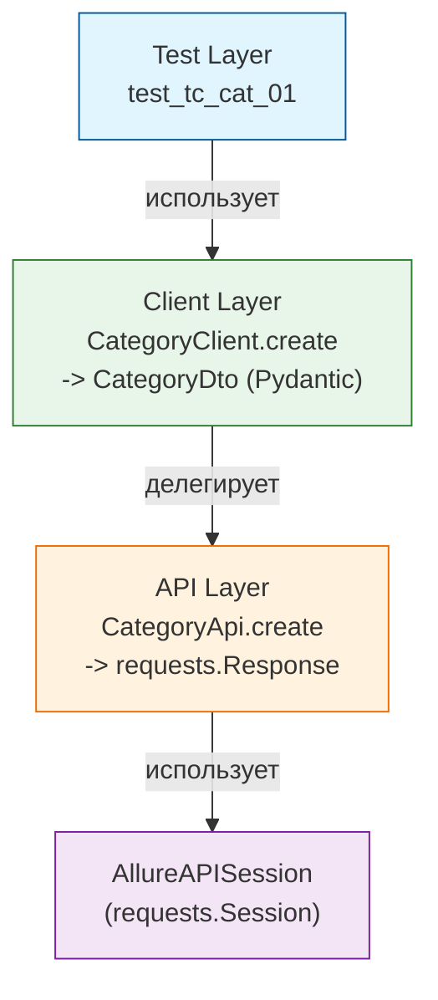

**Проект представляет собой комплексный, автоматизированный фреймворк для сквозного тестирования API и пользовательского интерфейса (UI/E2E) для галереи [sideglance.ru](https://sideglance.ru)**

[](https://github.com/lmveilfire/sideglance-qa/actions/workflows/python-api-tests.yml)
[](https://github.com/lmveilfire/sideglance-qa/actions/workflows/python-ui-tests.yml)
[](https://www.python.org)
[](https://docs.pytest.org/)
[](https://playwright.dev)
[](https://pydantic.dev)
[](https://mypy-lang.org)

**Python API Tests:**
[](https://lmveilfire.github.io/sideglance-qa/python-api/)
[](https://lmveilfire.github.io/sideglance-qa/python-api/)
[](https://lmveilfire.github.io/sideglance-qa/python-api/)

**Python UI Tests:**
[](https://lmveilfire.github.io/sideglance-qa/python-ui/)
[](https://lmveilfire.github.io/sideglance-qa/python-ui/)
[](https://lmveilfire.github.io/sideglance-qa/python-ui/)

### Стек технологий:

*   **Язык:** Python 3.10
*   **Тестовый движок:** pytest 9.1+
*   **Валидация и DTO:** Pydantic v2 (строгий рантайм-контроль контрактов API)
*   **Статический анализ:** mypy 2.3+ (в режиме `--strict` для слоя `src/`)
*   **Качество кода:** ruff (линтинг + форматирование в едином быстром тулчейне)
*   **HTTP-клиент:** requests
*   **Тестовые данные:** Faker (динамическая генерация)
*   **Управление конфигурацией:** python-dotenv (многоуровневая среда через `.env`)
*   **UI-тесты:** Playwright (async API) + `pytest-playwright-asyncio`, `pytest-asyncio`
*   **Отчётность:**** Allure Report (`allure-pytest`, публикуется в CI) + `pytest-html` (локальный отчёт, в CI не публикуется)


### Архитектура:
```
python/
├── src
│   ├── api                     # Слой транспорта: чистые HTTP-обёртки поверх requests (без проверок статусов, кроме методов получения токена)
│   ├── clients                 # Слой бизнес-клиентов: оркестрация запросов и маппинг в Pydantic DTO
│   ├── helpers                 # Утилитарные хелперы (авторизация, решение капчи, генерация сущностей)
│   ├── pages                   # UI Слой: Page Object классы для Playwright (изолированная работа с DOM)
│   └── utils
│       ├── constants.py        # HTTP-коды, лимиты времени, системные константы
│       ├── generators.py       # Faker-генераторы тестовых данных
│       ├── headers.py          # Утилита слияния и формирования заголовков запросов
│       └── models.py           # Строгие Pydantic-модели (схемы данных)
├── tests
│   ├── api                     # API-тесты: контракты, негативные сценарии
│   │   ├── auth                # Тесты авторизации: сессии, JWT-токены, валидация payload
│   │   ├── categories          # Тесты категорий: CRUD, контроль структуры ответов
│   │   ├── comments            # Тесты комментариев: модерация, защита от ботов (honeypot, fast-answer)
│   │   ├── photos              # Тесты фотографий: загрузка бинарных медиафайлов, инкремент счетчиков
|   │   └── subcategories       # Тесты подкатегорий: связность с родительскими категориями 
│   └── ui                      # UI/E2E-тесты: сквозные сценарии на Playwright
│        ├── admin              # Панель управления: закрытая часть для администратора
│        │   ├── auth           # Авторизация: успешный вход, обработка ошибок, редиректы
│        │   ├── moderate       # Модерация: интерактивное одобрение/отклонение комментариев, фильтры
│        │   └── upload         # Загрузка контента: добавление фото, интерактивное создание категорий
│        ├── users              # Публичная часть: действия пользователей (карусель, лайки, поиск, фильтры)
│        └── conftest.py        # Фикстуры UI: page-объекты, локаль и размер окна, скриншот при падении
├── conftest.py                 # Общий граф фикстур pytest + кастомная сессия AllureAPISession и хук, запоминающий результат теста
├── pytest.ini                  # Регистрация маркеров, строгие флаги запуска
├── pyproject.toml              # Единая конфигурация статических анализаторов mypy и ruff
└── requirements.txt / requirements-test.txt / requirements-dev.txt / requirements-ui.txt
    # Зависимости разделены по назначению: рантайм / прогон+отчётность / только разработка / UI
```

### Ключевые принципы:


```mermaid
flowchart TD
    A["Test Layer
    test_tc_cat_01"] -->|использует| B["Client Layer
    CategoryClient.create
    -> CategoryDto (Pydantic)"]
    B -->|делегирует| C["API Layer
    CategoryApi.create
    -> requests.Response"]
    C -->|использует| D["AllureAPISession
    (requests.Session)"]

    style A fill:#e1f5fe,stroke:#01579b
    style B fill:#e8f5e9,stroke:#2e7d32
    style C fill:#fff3e0,stroke:#ef6c00
    style D fill:#f3e5f5,stroke:#7b1fa2
```
### Типизированная валидация контрактов (Pydantic v2):

Высокоуровневые клиенты (`src/clients/`) автоматически валидируют входящие JSON-структуры и массивы (`TypeAdapter`) в момент их получения. Работа с ответами API в тестах происходит через свойства объектов (`photo.id`), а не через строковые ключи словарей.

### Изоляция транспортного уровня:

Слой `api` отвечает за отправку HTTP-запросов и возвращает сырой `requests.Response`. Используется напрямую в негативных тест-кейсах, где необходимо умышленно ломать заголовки и капчи и проверять коды ошибок. Единственное исключение это вспомогательные методы получения токена `AuthApi.get_token` и `get_auth_headers`: они нужны фикстурам авторизации и сами проверяют ответ. Слой `clients` инкапсулирует позитивную логику: проверяет статус-коды и возвращает в тесты строго типизированные DTO-объекты.

### Сетевая изоляция и стабильность Rate-Limit:
Бэкенд ограничивает частоту запросов по IP-адресу (`X-Forwarded-For`). Чтобы тесты создания комментариев не блокировали друг друга, для них предусмотрен метод `create_in_isolation`: он добавляет к запросу заголовок `X-Forwarded-For` со случайным адресом из `Generate.ip()`. Остальные запросы, включая авторизацию, идут с общего адреса.

### Диагностика падений:
При падении API-теста к отчёту прикладывается последний запрос и ответ, при падении UI-теста скриншот страницы.

### Типизация:
Для автоматического контроля за качеством кода и корректностью типов используются Mypy и Ruff:
*   **Mypy (строгий режим)**: код в (`src/`) полностью типизирован в строгом режиме (`strict = true`) — запрещены нетипизированные функции и неявный `Any`. При этом в слое генераторов данных (`src/utils/generators.py`) осознанно оставлен явный `**overrides: Any`, чтобы сохранялась возможность гибко переопределять любые поля в тестах на лету. Тестовый слой (`tests/`) типизируется в смягчённом режиме: строгие проверки на нетипизированные декораторы, вызовы и параметры функций отключены точечно.

*   **Ruff**: Используется для линтинга и форматирования кода.

*Исключение для контрактов API:* Для файла моделей (`**/src/utils/models.py`) в конфигурации отключено правило `N815` (`mixedCase`). Все Pydantic-модели намеренно используют `camelCase` именование полей, полностью дублируя оригинальный контракт Spring Boot бэкенда. Это избавляет от двустороннего маппинга данных и упрощает отладку через вкладку Network браузера.

### CI/CD:
Тесты запускаются двумя независимыми workflow: `python-api-tests.yml` (API) и `python-ui-tests.yml` (UI). Оба запускаются вручную. Каждый поднимает собственное окружение и публикует свой Allure-отчёт в отдельную папку ветки GitHub Pages (`python-api` и `python-ui`).

#### Джоб `tests`
1. Чекаутит репозиторий с тестами
2. Чекаутит приватный репозиторий с исходным кодом приложения по токену
3. Устанавливает Python 3.10 с кэшированием pip
4. Устанавливает зависимости фреймворка из файлов requirements
5. Ruff проверяет форматирование кода
6. Ruff выполняет быстрый статический анализ на потенциальные ошибки и баги
7. Mypy проверяет корректность аннотаций типов
8. Создаёт `.env` на основе GitHub Secrets
9. Собирает фронтенд (React) с увеличенным лимитом памяти, чтобы избежать падения раннера
10. Собирает образы бэкенда (Spring Boot) и фронтенда и поднимает окружение (PostgreSQL, backend, frontend) через Docker Compose
11. Ждёт готовности сервисов: в цикле опрашивает эндпоинты `/health` бэкенда и фронтенда через curl, при таймауте завершает пайплайн ошибкой
12. Запускает тесты Pytest на хосте раннера
13. Сохраняет сырые результаты Allure как артефакт GitHub Actions (хранение 7 дней)
14. Очищает окружение: останавливает контейнеры и удаляет volumes. Шаг выполняется даже при падении тестов

**Отличия между workflow:**

| | API | UI |
|---|---|---|
| Зависимости | основные, тестовые, dev | + UI-пакеты, браузер Chromium для Playwright (кэшируется) |
| Mypy | `src/api`, `src/clients`, хелперы авторизации и капчи, `src/utils`, `tests/api` | весь код: `src`, `tests`, `conftest.py` |
| Запуск | `pytest -m api tests/api` | `pytest -m ui tests/ui` (headless Chromium) |
| Вложения при падении | последний запрос и ответ API | скриншот страницы |
| Папка отчёта | `python-api` | `python-ui` |

#### Джоб `publish-report`
Запускается после `tests` независимо от его результата.
1. Скачивает артефакт с результатами Allure
2. Подтягивает историю прошлых запусков из ветки GitHub Pages, чтобы в отчёте работали тренды
3. Формирует метаданные запуска (номер сборки, ссылка на запуск в GitHub Actions)
4. Генерирует Allure-отчёт
5. Публикует отчёт в GitHub Pages

### Осознанные ограничения:

**Локаторы: data-testid вместо role-локаторов**
Локаторы опираются на идентификаторы `data-testid`: это договорённость между фронтендом и тестами, и она находится под контролем. При нескольких одинаковых элементах локатор уточняется через `.filter(has_text=...)`. Такие тесты не ломаются от смены вёрстки и стилей. Проверка доступности (accessibility) в задачи тестов не входит.

**Параллельный запуск (pytest-xdist) в CI пока не используется**

При текущем размере набора тестов последовательный прогон на 1 раннере не создаёт заметных издержек по времени.

**Почему авторизация выполняется в каждом тесте**

Токен администратора создаётся заново для каждого теста, а не один раз на весь прогон:
* Браузерный контекст создаётся на каждый тест, и хранилище `localStorage` в нём пустое. Поэтому токен в любом случае нужно записывать перед каждым UI-тестом.
* Для API токен идёт через `auth_headers`, для UI через `ui_auth_helper.login_as_admin()`.
* Независимость тестов. Тест, который меняет состояние авторизации (выход, отзыв токена), не ломает остальные, потому что у каждого своя сессия. Отладка нестабильного прогона из-за общей сессии дороже одного лишнего запроса.
* Цена низкая: один запрос `POST /api/auth/login` на тест почти не влияет на время прогона.

**Без очистки тестовых данных**
Во фреймворке намеренно отсутствуют хрупкие и тяжелые методы очистки данных после завершения тест-кейсов. Вместо этого архитектура тестирования построена на принципе полной изоляции состояний сред в CI/CD:
* Каждый пайплайн разворачивает чистый бэкенд и базу данных в Docker-контейнерах с нуля.
* Сразу после прогона тестов вся инфраструктура утилизируется командой `docker compose down -v`.
* Такой подход гарантирует чистый старт каждого прогона, исключает появление остаточного мусора в БД между прогонами пайплайнов и экономит процессорное время раннеров на лишние запросы на удаление сущностей через API. Независимость тестов внутри прогона держится на уникальных данных из Faker. Подход рассчитан на CI (на локальной постоянной БД данные копятся).