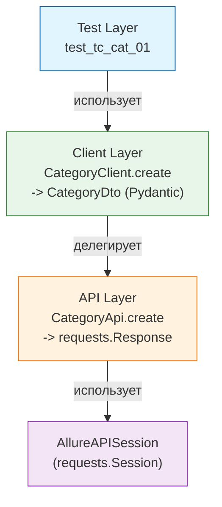

Проект представляет собой комплексный, масштабируемый автоматизированный фреймворк для сквозного тестирования API и пользовательского интерфейса (UI/E2E) для галереи [sideglance.ru](https://sideglance.ru)

[](https://github.com/lmveilfire/sideglance-qa/actions/workflows/python-api-tests.yml)
[](https://github.com/lmveilfire/sideglance-qa/actions/workflows/python-ui-tests.yml)
[](https://www.python.org)
[](https://docs.pytest.org/)
[](https://playwright.dev)
[](https://pydantic.dev)
[](https://mypy-lang.org)

### Стек технологий:

*   **Язык**: Python 3.10
*   **Тестовый движок**: pytest 9.1+
*   **Валидация и DTO**: Pydantic v2 (строгий рантайм-контроль контрактов API)
*   **Статический анализ**: mypy 2.3+ (в режиме `--strict` для слоя `src/`)
*   **Качество кода**: ruff (линтинг + форматирование в едином быстром тулчейне)
*   **HTTP-клиент**: requests
*   **Тестовые данные**: Faker (динамическая генерация)
*   **Управление конфигурацией**: python-dotenv (многоуровневая среда через `.env`)
*   **Отчётность**: Allure Report (`allure-pytest`) + `pytest-html`


### Архитектура
```
python-pytest/
├── src
│   ├── api                     # Слой транспорта: чистые HTTP-обёртки поверх requests (без проверок статусов внутри)
│   ├── clients                 # Слой бизнес-клиентов: оркестрация запросов и маппинг в Pydantic DTO
│   ├── helpers                 # Утилитарные хелперы (авторизация, решение капчи, генерация сущностей)
│   ├── pages                   # UI Слой: Page Object классы для Playwright (изолированная работа с DOM)
│   └── utils
│       ├── constants.py        # HTTP-коды, лимиты времени, системные константы
│       ├── generators.py       # Faker-генераторы тестовых данных
│       ├── headers.py          # Утилита слияния и формирования заголовков запросов
│       └── models.py           # Строгие Pydantic-модели (схемы данных)
├── tests
│   ├── api                     # API-тесты: контракты, негативные сценарии
│   │   ├── auth                # Тесты авторизации: сессии, JWT-токены, валидация payload
│   │   ├── categories          # Тесты категорий: CRUD, контроль структуры ответов
│   │   ├── comments            # Тесты комментариев: модерация, защита от ботов (honeypot, fast-answer)
│   │   ├── photos              # Тесты фотографий: загрузка бинарных медиафайлов, инкремент счетчиков
|   │   └── subcategories       # Тесты подкатегорий: связность с родительскими категориями 
│   └── ui                      # UI/E2E-тесты: сквозные сценарии на Playwright
│        ├── admin              # Панель управления: закрытая часть для администратора
│        │   ├── auth           # Авторизация: успешный вход, обработка ошибок, редиректы
│        │   ├── moderate       # Модерация: интерактивное одобрение/отклонение комментариев, фильтры
│        │   └── upload         # Загрузка контента: добавление фото, интерактивное создание категорий
│        ├── users              # Публичная часть: действия пользователей (карусель, лайки, поиск, фильтры)
│        └── conftest.py        # Фикстуры для UI: управление браузером, контекстами и страницами Playwright
├── conftest.py                 # Общий граф фикстур pytest + кастомная сессия AllureAPISession
├── pytest.ini                  # Регистрация маркеров, строгие флаги запуска
├── pyproject.toml              # Единая конфигурация статических анализаторов mypy и ruff
└── requirements.txt / requirements-test.txt / requirements-dev.txt / requirements-ui.txt
    # Зависимости разделены по назначению: рантайм / прогон+отчётность / только разработка / UI
```

### Ключевые принципы


```mermaid
flowchart TD
    A["Test Layer
    test_tc_cat_01"] -->|использует| B["Client Layer
    CategoryClient.create
    -> CategoryDto (Pydantic)"]
    B -->|делегирует| C["API Layer
    CategoryApi.create
    -> requests.Response"]
    C -->|использует| D["AllureAPISession
    (requests.Session)"]

    style A fill:#e1f5fe,stroke:#01579b
    style B fill:#e8f5e9,stroke:#2e7d32
    style C fill:#fff3e0,stroke:#ef6c00
    style D fill:#f3e5f5,stroke:#7b1fa2
```
### Type-Driven Валидация контрактов (Pydantic v2)

Высокоуровневые клиенты (`src/clients/`) автоматически валидируют входящие JSON-структуры и массивы (`TypeAdapter`) в момент их получения. Работа с ответами API в тесах происходит через свойства объектов (`photo.id`, `page.totalCount`), а не через строковые ключи словарей.

### Изоляция транспортного уровня:

Слой `api` отвечает исключительно за отправку HTTP-запросов и возвращает «сырой» `requests.Response`. Используется напрямую в негативных тест-кейсах, где необходимо умышленно ломать заголовки/капчи и проверять коды ошибок. Слой `сlient` инкапсулирует позитивную логику. Он доверяет контракту бэкенда, отсекает ошибочные статус-коды и возвращает в тесты готовые, строго типизированные DTO-объекты.


### UI Автоматизация на Playwright (Page Object Model):

Слой страниц в `src/pages/` инкапсулирует в себе всю работу с DOM-деревом React-приложения. Вместо хрупких, зависящих от дизайна селекторов (`getByRole`, `getByLabel`), локаторы жестко привязаны к семантическим идентификаторам **`data-testid`** в сочетании с явной фильтрацией по тексту `.filter(has_text=...)`. Это защищает тесты от падений при изменении компонентов фронтенда. Для изоляции сред UI-пайплайн полностью вынесен в независимый воркфлоу `python-ui-tests.yml`.


### Сетевая изоляция и стабильность Rate-Limit
Бэкенд приложения (Spring Boot) реализует строгий контроль частоты запросов (`Rate Limiting`) по IP-адресу пользователя (`X-Forwarded-For`). Чтобы исключить эффект взаимной блокировки и `flaky`-тестов при общем прогоне, во фреймворк внедрен механизм динамической подмены сетевого контекста: на каждый изолированный запрос через генератор `Generate.ip()` подмешивается уникальный заголовок `X-Forwarded-For`. Это полностью снимает ложную инфраструктурную нагрузку со стенда.

### Осознанный отказ от Teardown (Парадигма Stateless CI)
Во фреймворке намеренно отсутствуют хрупкие и тяжелые методы очистки данных (`teardown`) после завершения тест-кейсов. Вместо этого архитектура тестирования построена на принципе полной изоляции состояний сред в CI/CD:
* Каждый пайплайн разворачивает абсолютно чистый бэкенд и базу данных в Docker-контейнерах с нуля.
* Сразу после прогона тестов вся инфраструктура утилизируется командой `docker compose down -v`.
* Такой подход гарантирует 100% воспроизводимость тестов, исключает появление остаточного «мусора» в БД между прогонами пайплайнов и экономит процессорное время раннеров на ручные удаления сущностей через API.

### Типизация
Для автоматического контроля за качеством кода и корректностью типов используются Mypy и Ruff:
*   **Mypy (строгий режим)**:(`src/`) полностью типизирован в строгом режиме (`strict = true`) — запрещены нетипизированные функции и неявный `Any`. При этом в слое генераторов данных (`src/utils/generators.py`) осознанно оставлен явный `**overrides: Any`, чтобы сохранялась возможность гибко переопределять любые поля в тестах на лету. Тестовый слой (`tests/`) типизируется в смягчённом режиме: строгие проверки на нетипизированные декораторы, вызовы и параметры функций отключены точечно.

*   **Ruff**: Используется для линтинга и форматирования кода  с лимитом длины строки в 100 символов. Настроен на проверку базового синтаксиса, сортировку импортов и поиск code smells (правила `E`, `W`, `F`, `I`, `N`, `UP`, `B`, `C4`, `SIM`).

*Исключение для контрактов API:* Для файла моделей (`**/src/utils/models.py`) в конфигурации отключено правило `N815` (`mixedCase`). Все Pydantic-модели намеренно используют `camelCase` именование полей, полностью дублируя оригинальный контракт Spring Boot бэкенда. Это избавляет от двустороннего маппинга данных и упрощает отладку через вкладку Network браузера.

### CI/CD
1. Чекаутит репозиторий с тестами
2. Чекаутит приватный репозиторий с исходным кодом приложения по токену.
3. Устанавливает Python 3.10 с кэшированием pip
4. Из файлов requirements.txt устанавливаются все основные, тестовые и dev-пакеты фреймворка
5. Утилита ruff проверяет соответствие кода тестов принятым стандартам оформления
6. Выполняется быстрый статический анализ кода на наличие потенциальных ошибок и багов
7. Линтер mypy проверяет корректность аннотаций типов в исходном коде тестового фреймворка, тестах и конфигурационных файлах.
8. Создаёт .env на основе GitHub Secrets
9. Собирает фронтенд (React) с увеличенным лимитом памяти, чтобы избежать падения раннера
10. Запускается сборка образов бэкенда (Spring Boot) и фронтенда внутри Docker context
11. Поднимает окружение (PostgreSQL, backend, frontend) с healthcheck-ами
12. Контролирует готовность сервисов. Скрипт в цикле опрашивает эндпоинты /health бэкенда и фронтенда через curl, ожидая их полной готовности к тестам
13. Запускаются api-тесты Pytest прямо на хосте раннера
14. Архивирует HTML- и Allure-отчёты как артефакты GitHub Actions
15. Очищает окружение: останавливает контейнеры и удаляет volumes


### Осознанные ограничения:

**Параллельный запуск (pytest-xdist) в CI пока не используется**

При текущем размере набора тестов последовательный прогон на 1 раннере не создаёт заметных издержек по времени.