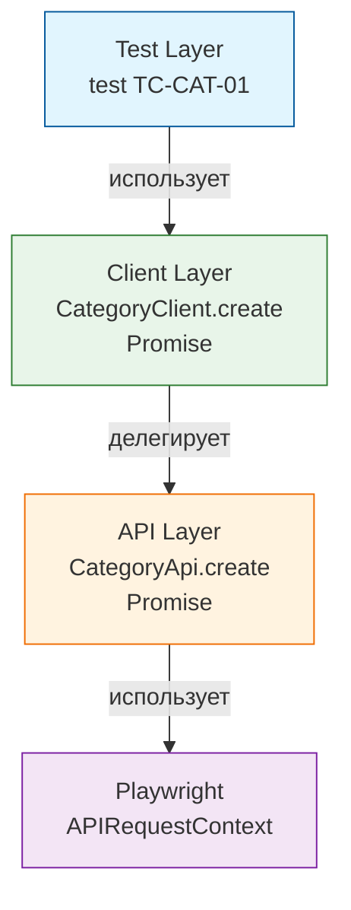

> E2E и API-тесты для галереи [sideglance.ru](https://sideglance.ru)

[](https://github.com/lmveilfire/sideglance-qa/actions/workflows/playwright.yml)
[](https://www.typescriptlang.org/)
[](https://playwright.dev)

### Стек технологий: 

**Язык**: TypeScript 


**Тестовый движок**: Playwright Test


**Качество кода**: ESLint (статический анализ) + Prettier (форматирование)


**Тестовые данные**: @faker-js/faker


**Управление окружением**: dotenv (конфигурация через `.env` файлы)


**Отчетность**: Allure Report

### Архитектура
```
typescript-playwright/           
├── src
│   ├── api                     # Слой транспорта: чистые HTTP-обёртки
│   ├── clients                 # Слой клиентов: бизнес-методы поверх Api
│   ├── fixtures                # Изолированные фикстуры: auth, cleanup
│   ├── helpers                 # Хелперы: генераторы данных, декораторы @step, statusIn
│   ├── pages                   # Page Objects для UI-тестов
│   └── utils                   # Утилиты
│       ├── constants.ts        # HTTP-коды, адреса, лимиты
│       ├── decorators.ts       # `@step()` — читаемые шаги в Allure-отчёте
│       ├── generators.ts       # faker-генераторы тестовых данных
│       ├── headers.ts          # Утилита `mergeHeaders` для кастомного хелпера авторизации
│       ├── matchers.ts         # Шаблоны частичной валидации ответов бэкенда на базе expect.any()
│       └── types.ts            # Слой DTO и типов: интерфейсы запросов и ответов бэкенда
├── tests                       # Тесты
│   ├── api                     # API-тесты: контракты, негативные сценарии, rate-limit
│   └── ui                      # UI-тесты
├── package.json                # Скрипты, зависимости, typescript
├── playwright.config.ts        # Конфиг: окружения, ретраи, отчёты
└── tsconfig.json
 
```
### Ключевые принципы

**Изоляция транспортного уровня:**


Слой `api` отвечает только за транспорт и возвращает `APIResponse` как есть, не анализируя статус-коды. Такое разделение осознанно: негативные тесты (без токена, с невалидными телами) обращаются к слою `api` напрямую, чтобы проверять ошибки. Для позитивных сценариев реализован слой clients, обертка над api, которая скрывает работу с сырыми HTTP-ответами и возвращает удобные для тестов данные или чистые DTO.

**Типизация:**


Фреймворк написан со строгим контролем типов. Компилятор настроен на максимум (`strict: true`, `noUncheckedIndexedAccess`), а все запросы и ответы бэкенда описаны через интерфейсы DTO. В местах, где Playwright по умолчанию возвращает `any` (например, при вызове `APIResponse.json()`), данные явно приводятся к нужному DTO через дженерики или `as`, вместо того чтобы глушить линтер комментариями.

**Гибкая валидация контрактов:**


 Вместо жесткого сравнения "значение-в-значение" применяются готовые шаблоны объектов (`PhotoMatcher`, `CategoryMatcher`). Они проверяют структуру ответа и типы полей через встроенные асимметричные матчеры, что гарантирует стабильность тестов при изменении динамических данных (ID, просмотры, лайки).

### CI/CD
1. Чекаутит репозиторий с тестами
2. Чекаутит приватный репозиторий с исходным кодом приложения по токену
3. Создаёт .env на основе GitHub Secrets
4. Устанавливает Node.js 24
5. Восстанавливает кэш node_modules из предыдущих запусков (по хэшу package-lock.json)
6. Устанавливает зависимости через npm ci
7. Устанавливает браузер Chromium и системные зависимости
8. Собирает фронтенд (React) с увеличенным лимитом памяти, чтобы избежать падения раннера
9. Запускается сборка образов бэкенда (Spring Boot) и фронтенда внутри Docker context
10. Поднимает окружение (PostgreSQL, backend, frontend) с healthcheck-ами
11. Контролирует готовность сервисов. Скрипт в цикле опрашивает эндпоинты /health бэкенда и фронтенда через curl, ожидая их полной готовности к тестам
12. Запускаются e2e-тесты Playwright прямо на хосте раннера и отправляют HTTP/UI запросы в поднятые Docker-контейнеры
13. Архивирует Playwright и Allure отчёты как артефакты GitHub Actions
14. Очищает окружение: останавливает контейнеры и удаляет volumes

### Осознанные ограничения:
**Тест на рейт-лимит логина изолирован от общего прогона** 


Обнаружено реальным прогоном в CI: бэкенд после серии неудачных попыток логина блокирует IP на срок, превышающий длительность всего остального тестового набора. 
Помечен тегом `@security` и исключён из основного пайплайна через конфигурацию `grepInvert: /@security/` в `playwright.config.ts`.

**Параллельный запуск в CI пока не используется**


При текущем размере набора тестов последовательный прогон не создаёт заметных издержек по времени. Для стабильности окружения в `playwright.config.ts` явно выставлен параметр `workers: 1`.


