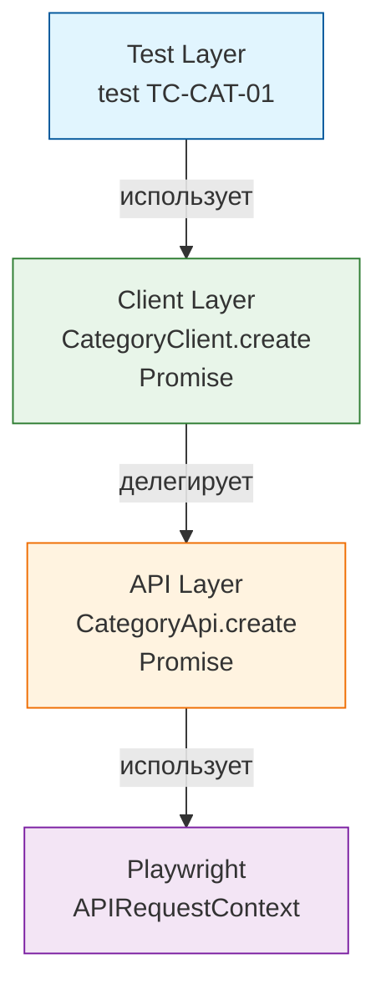

**Проект представляет собой комплексный, автоматизированный фреймворк для сквозного тестирования API и пользовательского интерфейса (UI/E2E) для галереи [sideglance.ru](https://sideglance.ru)**

[](https://github.com/lmveilfire/sideglance-qa/actions/workflows/typescript-api-ui.yml)
[](https://www.typescriptlang.org/)
[](https://playwright.dev)
[](https://zod.dev)
[](https://eslint.org)

###  Allure Reports

**TypeScript API & UI Tests:**
[](https://lmveilfire.github.io/sideglance-qa/typescript/)
[](https://lmveilfire.github.io/sideglance-qa/typescript/)
[](https://lmveilfire.github.io/sideglance-qa/typescript/)


### Стек технологий: 

* **Язык**: TypeScript 6.0.3 / Node.js v20.20.2
* **Тестовый движок**: Playwright Test
* **Валидация и DTO**: Zod (строгий runtime-контроль схем данных)
* **Качество кода**: ESLint 9.39.4 + Prettier 3.8.4
* **Тестовые данные**: @faker-js/faker
* **Управление окружением**: dotenv (конфигурация через `.env` файлы)
* **Отчетность**: Allure Report (`allure-pytest`, публикуется в CI)

### Архитектура
```
typescript-playwright/           
├── src
│   ├── api                     # Слой транспорта: чистые HTTP-обёртки (без проверок статусов, кроме методов получения токена)
│   ├── clients                 # Слой бизнес-клиентов: оркестрация запросов и парсинг в Zod DTO
│   ├── fixtures                # Изолированный граф фикстур: расширение базового test.extend
│   ├── helpers                 # Утилитарные бизнес-хелперы (авторизация, решение капчи, генерация сущностей)
│   ├── pages                   # UI Слой: Page Object классы для Playwright (изолированная работа с DOM)
│   └── utils                   
│       ├── apiHelpers.ts       # Вспомогательные функции для API (проверка статусов, обработка ошибок)
│       ├── constants.ts        # HTTP-коды, лимиты времени, системные константы
│       ├── decorators.ts       # `@step` — читаемые шаги в Allure-отчёте
│       ├── generators.ts       # faker-генераторы тестовых данных
│       ├── headers.ts          # Утилита `mergeHeaders` для кастомного хелпера авторизации
│       └── schemas.ts          # Слой строгих Zod-схем и выведенных TypeScript типов (DTO)
├── tests
│   ├── api                     # API-тесты: контракты, негативные сценарии
│   │   ├── auth                # Тесты авторизации: сессии, JWT-токены, валидация payload
│   │   ├── categories          # Тесты категорий: CRUD, контроль структуры ответов
│   │   ├── comments            # Тесты комментариев: модерация, защита от ботов (honeypot, fast-answer)
│   │   ├── photos              # Тесты фотографий: загрузка бинарных медиафайлов, инкремент счетчиков
|   │   └── subcategories       # Тесты подкатегорий: связность с родительскими категориями 
│   └── ui                      # UI/E2E-тесты: сквозные сценарии на Playwright
│        ├── admin              # Панель управления: закрытая часть для администратора
│        │   ├── auth           # Авторизация: успешный вход, обработка ошибок, редиректы
│        │   ├── moderate       # Модерация: интерактивное одобрение/отклонение комментариев, фильтры
│        │   └── upload         # Загрузка контента: добавление фото, интерактивное создание категорий
│        ├── users              # Публичная часть: действия пользователей (карусель, лайки, поиск, фильтры)
├── package.json                # Скрипты, зависимости, typescript
├── playwright.config.ts        # Конфиг: окружения, ретраи, отчёты
└── tsconfig.json
 
```
### Ключевые принципы


### Типизированная валидация контрактов:

Высокоуровневые клиенты (src/clients/) автоматически валидируют входящие JSON-структуры и массивы через Zod-схемы в момент их получения. Строгая типизация выводится напрямую из схем (z.infer), поэтому работа с ответами API в тестах происходит через безопасные свойства объектов (photo.id), а не через небезопасные приведения типов (as any) или ручную проверку полей.

### Сетевая изоляция и стабильность Rate-Limit:
Бэкенд ограничивает частоту запросов по IP-адресу (`X-Forwarded-For`). Чтобы тесты создания комментариев не блокировали друг друга, для них предусмотрен метод `createInIsolation`: он добавляет к запросу заголовок `X-Forwarded-For` со случайным адресом из `generate.ip()`. Остальные запросы, включая авторизацию, идут с общего адреса.

### Диагностика падений:
При падении API-теста к отчёту прикладывается последний запрос и ответ, при падении UI-теста скриншот страницы.
### Типизация и контроль качества:
Для автоматического контроля за качеством кода и корректностью типов используются TypeScript Compiler (в строгом режиме) и ESLint:

*  **TypeScript & TypeScript-ESLint (строгий режим):** Код в слое (`src/`)типизируется в максимально строгом режиме (`strict: true`, `exactOptionalPropertyTypes`, `noUncheckedIndexedAccess`, `noImplicitReturns`). Это полностью исключает неявные `any`, непроверенные индексы и недостижимый код. Тестовый слой `(tests/)` использует смягченный профиль *ESLint*: правило `@typescript-eslint/no-explicit-any` настроено как warn, чтобы сохранять гибкость при генерации тестовых данных и моков, при этом компилятор по-прежнему жестко контролирует неиспользуемые переменные и параметры.

*  **ESLint & Playwright Plugin:** Используется для статического анализа, сортировки импортов и навязывания лучших практик Playwright (правила `missing-playwright-await`, `no-conditional-in-test`). Настроен на выявление скрытых дефектов и на поддержание чистоты синтаксиса.

### CI/CD
#### Джоб `tests`
1. Чекаутит репозиторий с тестами
2. Чекаутит приватный репозиторий с исходным кодом приложения по токену
3. Создаёт .env на основе GitHub Secrets
4. Устанавливает Node.js 24
5. Восстанавливает кэш node_modules из предыдущих запусков (по хэшу package-lock.json)
6. Устанавливает зависимости через npm ci
7. Устанавливает браузер Chromium и системные зависимости
8. Собирает фронтенд (React) с увеличенным лимитом памяти, чтобы избежать падения раннера
9. Запускается сборка образов бэкенда (Spring Boot) и фронтенда внутри Docker context
10. Поднимает окружение (PostgreSQL, backend, frontend) с healthcheck-ами
11. Контролирует готовность сервисов. Скрипт в цикле опрашивает эндпоинты /health бэкенда и фронтенда через curl, ожидая их полной готовности к тестам
12. Запускаются тесты прямо на хосте раннера и отправляют HTTP/UI запросы в поднятые Docker-контейнеры
13. Сохраняет сырые результаты Allure как артефакт GitHub Actions (хранение 7 дней)
14. Очищает окружение: останавливает контейнеры и удаляет volumes


#### Джоб `publish-report`
Запускается после `tests` независимо от его результата.
1. Скачивает артефакт с результатами Allure
2. Подтягивает историю прошлых запусков из ветки GitHub Pages, чтобы в отчёте работали тренды
3. Формирует метаданные запуска (номер сборки, ссылка на запуск в GitHub Actions)
4. Генерирует Allure-отчёт
5. Публикует отчёт в GitHub Pages


### Осознанные ограничения:

**Локаторы: data-testid вместо role-локаторов**
Локаторы опираются на идентификаторы `data-testid`: это договорённость между фронтендом и тестами, и она находится под контролем. При нескольких одинаковых элементах локатор уточняется через `.filter(has_text=...)`. Такие тесты не ломаются от смены вёрстки и стилей. Проверка доступности (accessibility) в задачи тестов не входит.

**Параллельный запуск (pytest-xdist) в CI пока не используется**

При текущем размере набора тестов последовательный прогон на 1 раннере не создаёт заметных издержек по времени.


**Параллельный запуск в CI пока не используется**

При текущем размере набора тестов последовательный прогон не создаёт заметных издержек по времени. Для стабильности окружения в `playwright.config.ts` явно выставлен параметр `workers: 1`.


**Почему авторизация выполняется в каждом тесте**

Токен администратора создаётся заново для каждого теста, а не один раз на весь прогон:
* Браузерный контекст создаётся на каждый тест, и хранилище `localStorage` в нём пустое. Поэтому токен в любом случае нужно записывать перед каждым UI-тестом.
* Для API токен идёт через `authHeaders`, для UI через `uiAuthHelper.loginAsAdmin()`.
* Независимость тестов. Тест, который меняет состояние авторизации (выход, отзыв токена), не ломает остальные, потому что у каждого своя сессия. Отладка нестабильного прогона из-за общей сессии дороже одного лишнего запроса.
* Цена низкая: один запрос `POST /api/auth/login` на тест почти не влияет на время прогона.


**Без очистки тестовых данных**
Во фреймворке намеренно отсутствуют хрупкие и тяжелые методы очистки данных после завершения тест-кейсов. Вместо этого архитектура тестирования построена на принципе полной изоляции состояний сред в CI/CD:
* Каждый пайплайн разворачивает чистый бэкенд и базу данных в Docker-контейнерах с нуля.
* Сразу после прогона тестов вся инфраструктура утилизируется командой `docker compose down -v`.
* Такой подход гарантирует чистый старт каждого прогона, исключает появление остаточного мусора в БД между прогонами пайплайнов и экономит процессорное время раннеров на лишние запросы на удаление сущностей через API. Независимость тестов внутри прогона держится на уникальных данных из Faker. Подход рассчитан на CI (на локальной постоянной БД данные копятся).


